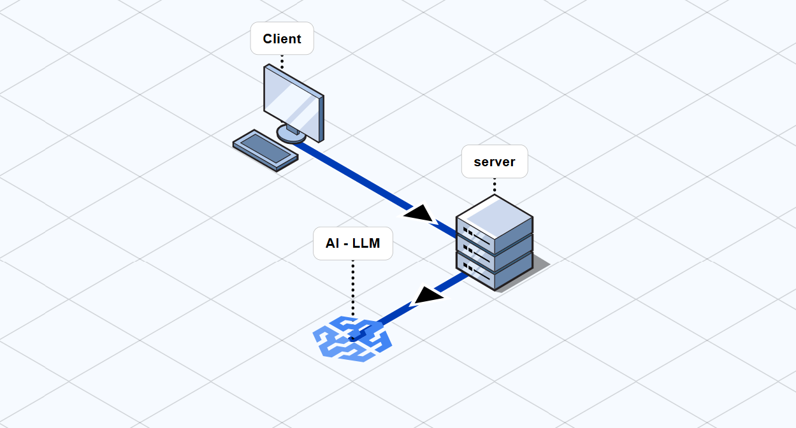

## 🔮 TarotGPT 서비스

TarotGPT는 사용자가 선택한 타로 카드를 기반으로 LLM이 점괘를 해석하고, 그 내용에 대해 자연스러운 대화를 나눌 수 있는 AI 기반 타로 챗봇 서비스입니다.

## ✨ 핵심 기능

타로 카드 선택 및 해석

사용자가 선택한 카드를 기반으로 맞춤형 결과 제공

LLM을 통해 카드의 의미를 상황에 맞게 해석

실시간 AI 챗봇 대화

카드의 해석 결과에 대한 추가 질문 가능

친절하고 자연스러운 챗봇 응답 제공

## 🚀 기술 스택

- 프론트엔드

React (Vite)

Tailwind CSS

- 백엔드

Fast API

Google AI API

## 🌐 구조도

